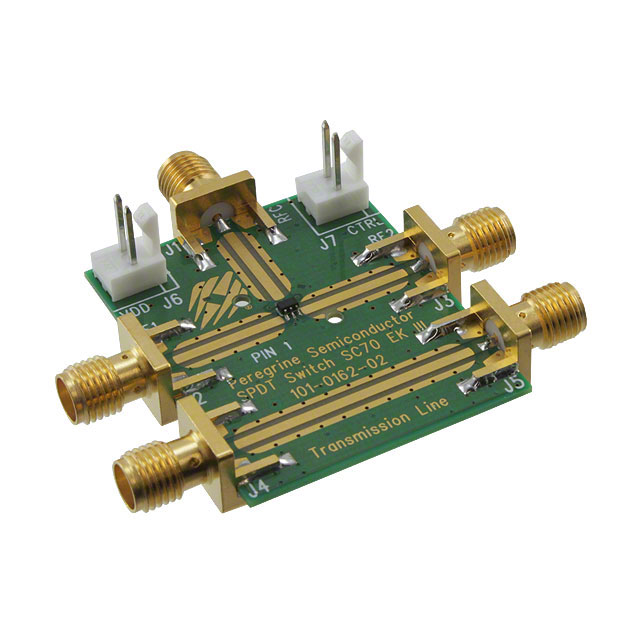
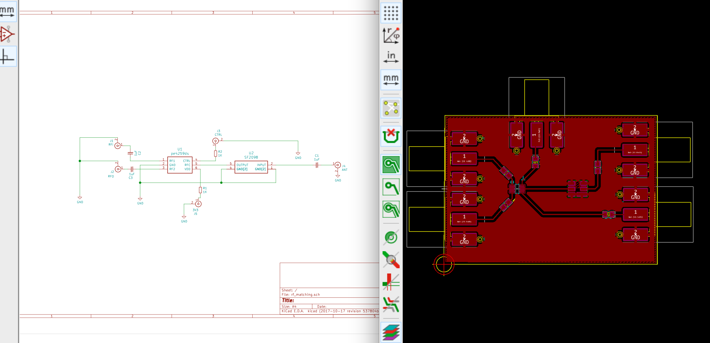
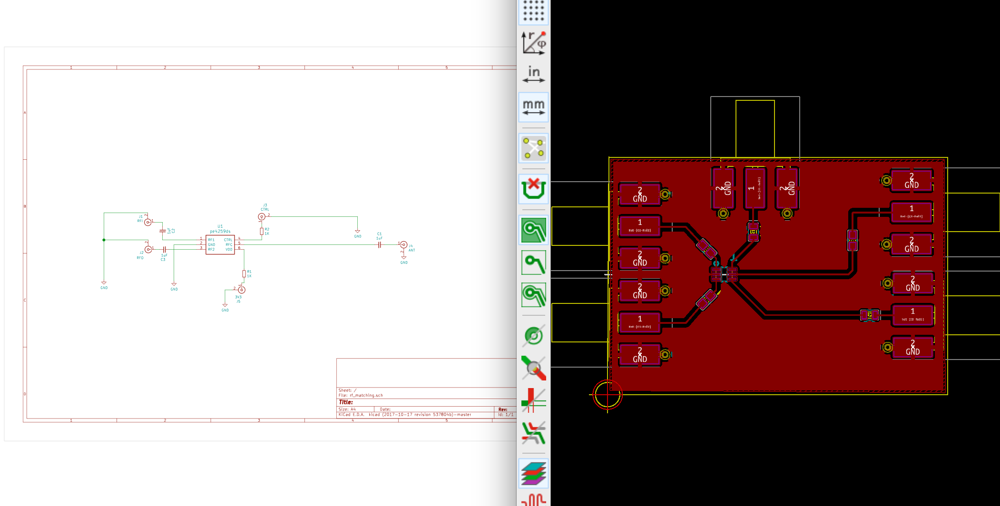
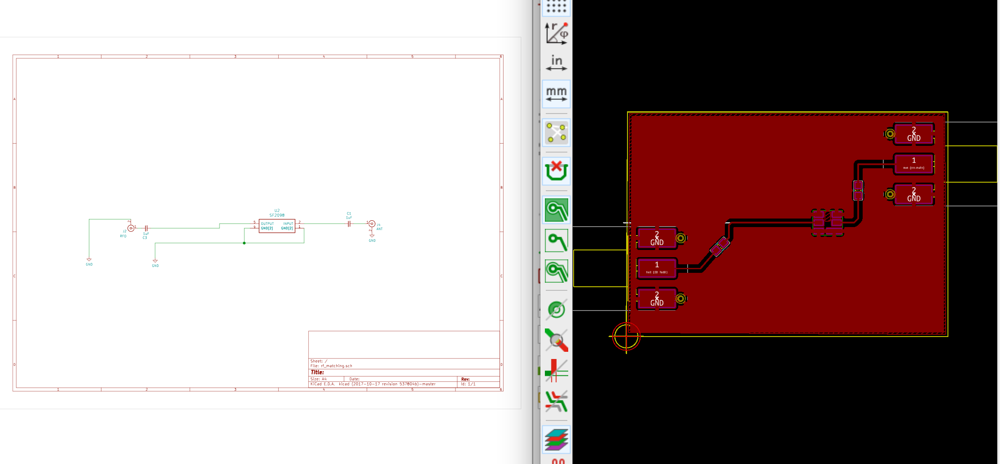
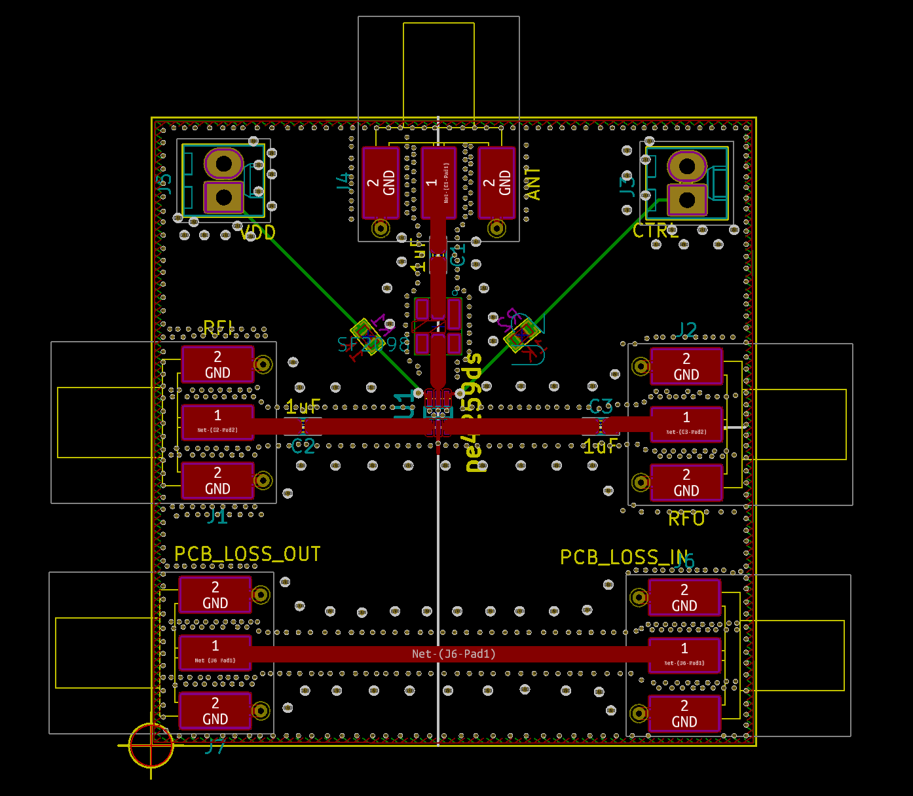

# 915Mhz RF filter breakout boards


This is an experiment with a 915Mhz LoRa module and SAW filters as a substitute for discrete components. The original *raison d'être* of this repository is my personal outrage after seeing the following **$100 evaluation board** for the [PE4259](https://www.psemi.com/pdf/datasheets/pe4259ds.pdf):


<p align="center">

</p>

And indeed, [AppliedCarbon from OSHPark also thought so and designed a smaller PCB](https://oshpark.com/shared_projects/2MRloEFC).

Gold tracks and pads, many vias and proper RF engineering, sure, but $100 plus shipping? Let's see how the homemade way works in comparison? On the **`master`** branch of this repository, I'm putting together a board with the RF switch and the SAW filter (will be using a 915 Mhz [sf2098e "low insertion loss" SAW filter](https://wireless.murata.com/RFM/data/sf2098e.pdf), no frills design for now. I might put the vias in place if needed in the future and compare performance/loss and the accompanying [S parameters](https://en.wikipedia.org/wiki/Scattering_parameters).

<p align="center">

</p>

But since the approach above might not be modular enough for my testing purposes (thanks Chris), I've forked that layout into two branches:

```bash
$ git branch -a
* master
  rf_switch_only
  saw_filter_only
```

Here's how each of those look like at the moment of writing this, let's play "spot the differences", shall we?:

<p align="center">

</p>

<p align="center">

</p>

Now, as with the [Instructables Carvey Board project](https://github.com/brainstorm/carvey_board), I've generated some G-Code (under the **homefab** subdirectory) with [FlatCam](http://flatcam.org/) to carve those board at home, wish me luck with the spectrum analyzers and followup testing!

Alternatively, there's a .zip under homefab, containing the ready-to-send gerbers to i.e Seed Studios or any other PCB manufacturer. Here's the latest iteration of the rf matching board on `master`:

<p align="center">

</p>
